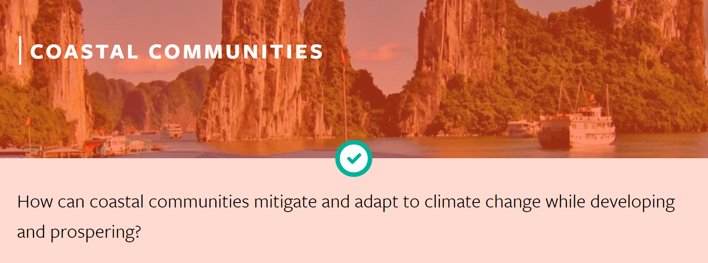
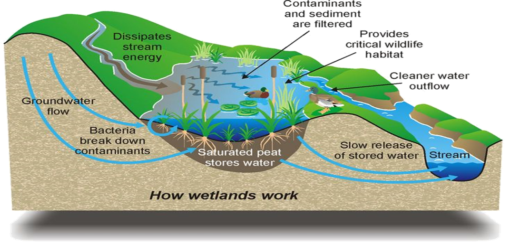

<h1 style="text-align: center">MIT Solve</h1>

  

# BACKGROUND
According to Chinese Ocean News, the increase of the sea level caused by global warming has done great harm to the coastal city in China. The rising sea level corrode and **salinize the coastal land**. In China, Liaoning Province is one of the most seriously corroded cities. The sea level rises at a speed of 3.2 millimeter per year. From 2004 to 2006, the sea level of Liaoning Province was always above the average of previous years. The rising sea level deeply harmed the seawater intrusion disaster, and the **Jinzhou region**, Dalian region are the most typical victims.  
Today, we will talk about a city in Liaoning Province——Jinzhou. Jinzhou locates at the north of Liaodong Bay of Bohai sea. According to the researchers at the Jinzhou Marine Environment Monitoring Station, the salinization region mainly assembles at the west of Daling river estuary and the east of the Xiaoling river estuary. The area of the salinization region is 560 square kilometers, and the distance of the salinization region from the land area is about 0 kilometers, which is very close.   
The **salinization** brings absolute harm to many domains.  
**For agriculture**, including soil compaction, soil fertility decline, crop reduction, plant simplification and the regional ecological function decline.   
**For industry**, the seawater intrusion leads to the underground water salinization which destroys the automatic water supply machine and the underneath.  
**For residents**, the quality of drinking water was negatively affected and endemic diseases spread.  
We can see that we people really should take serious of the salinization issue and try our best to make a better environment. There are some effective ways to solve the problem, such as reducing the exploit of underground water., improve the quality of the soil by planting some saline-alkali tolerant plant.  

# OUR SOLUTION
For our team’s solution, we plan to utilize the salinization area to build a wetland park. We want to reduce the negative effect of the salinization and make people a more livable city. This solution is practical because we already have Hong Kong Wetland Park and Guangzhou Wanqing wetland park under similar circumstances and conditions. We believe that the utilization of the waste land will increase and the environment conditions will improve.    

Inside the wetland park, we need commercialization to benefit the government, the society, and the citizens as well. Therefore, we urge some environmentally friendly and commercially beneficial programs. For instance, we project a certain area in the wetland park and sell the seed and seedling of a certain kind of tree which we call it "shui pu tao" in Chinese(Syzygium jambos（L.）Alston). We encourage every visitor who come to the wetland park to buy one and plant it themselves. This tree can grow really fast and it has been proved by other wetland park all across China that how beautiful and appealing it is in the park. Most importantly, it can grow on saline-alkali soil and turn that soil into normal soil. In China's farming markets, this tree is totally affordable for any normal citizens. After several months or a year, this tree would cover some part the park and gradually change the salinization situation. At the same time, citizens get involved and builder of the park get benefit.   

# IMPACT
Almost all coastal countries have cities affected by salinization worldwide. In those cities, wetland park construction can effectively solve or eliminate the problem. The city we mentioned, Jinzhou, is just an example. Here goes the ways it works:  
- prevention of salt water intrusion---coastal vegetation helps prevent the tide from flowing into the river.
- water supply---For residents, agriculture and industry.  
- recharge groundwater---Water from wetlands to aquifers can become part of the groundwater system and provide water for industrial and agricultural production in surrounding areas.  
- remove and transform the poisons and impurities---wetlands help to slow down the speed of water flow, which is advantageous to the precipitation and eliminate toxins and impurities.  
- embankments protection, windproof---wetland can resist waves, the impact of the typhoon and storm, and can prevent the erosion of coast, at the same time, their roots can be fixed and stable bank and coast and can also protect coastal industrial and agricultural production.  
- reserve nutrients---nutrients in wetlands nourish fish, shrimp, trees, wildlife, and wetland crops.
- keep the microclimate---wetlands can affect the microclimate.
The water in the wetland evaporates into water vapor and then falls to the surrounding area in the form of precipitation to maintain local humidity and rainfall.
- habitat of wild animals---wetland is the breeding, habitat, migratory and wintering place of birds, fish and amphibians, many of which are rare and endangered species.

If we make it to build wetland parks in cities affected, we help to solve the salinization problem in coastal cities. In this way, we make the world a better place.

# POTENTIAL PARTNER
Jinzhou government
